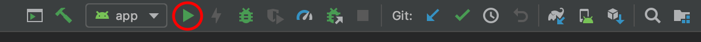
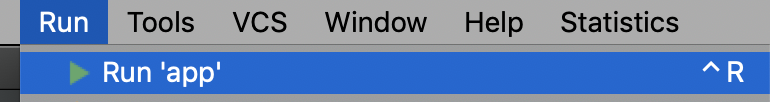

# Plaid Link Sample Android App
Detailed instructions on how to integrate with Plaid Link for Android can be found in our main documentation at [plaid.com/docs/link/android][link-android-docs].

This repository contains a sample application that demonstrates integration and use of Plaid Link for Android.  There are activities that show how to open link from Kotlin or Java.

# Getting Started
## Requirements
Android Studio 3.0 or greater
A Plaid public_key; available from the Plaid Dashboard

## Running the app
1. Clone the repository
``` sh
git clone https://github.com/plaid/plaid-link-android.git
```
2. Open the repository with Android Studio (or IntelliJ)
3. Add your plaid public key from the Plaid Dashboard to the donottranslate.xml file
``` xml
<string name="plaid_public_key">TODO Add your key here</string>
```
4. Build and run from Android Studio (green arrow or Run -> Run App) 





Or run from the command line 
``` sh
./gradlew installDebug
 adb shell am start -n "com.plaid.linksample/com.plaid.linksample.MainActivity" -a android.intent.action.MAIN -c android.intent.category.LAUNCHER
```

# App Features
The repository contains a java and kotlin application class and a java and kotlin activity.  From the kotlin activity you can open the java activity using the menu in the action bar and similarly from the java activity you can open the kotlin activity from the same menu.  If you want to test the java appplication class instead of the kotlin application class just change the name in the application tag in the Android manifest to ```name=".LinkSampleJavaApplication"```.

When running the app, the floating action button will start the Link flow and when the flow completes (with a success, cancellation, error, or crash) you will see the results in the main activity.

