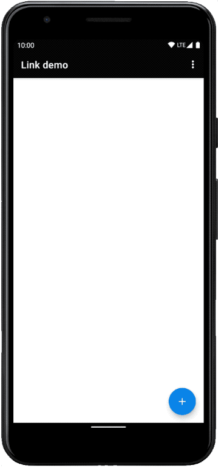

# Plaid Link Sample Android App [![version][link-sdk-version]][link-sdk-url]
This sample app will show you how Link Android SDK can integrate with your own app in both Kotlin and Java. Check out [the benefits](./docs/sdk-vs-webview-comparison.md) of using the SDK. 


<p align="center">
  
</p>

> Detailed instructions on how to integrate with Plaid Link for Android in your app can be found in our [main documentation][link-android-docs].

# Getting Started
To run the sample app, you'll need a Plaid account. You can create one on [our website][plaid-signup].

## 1. Register your app id
1. Log into your [Plaid Dashboard][plaid-dashboard-api] at the API page
2. Next to "Allowed Android package names" click "Configure" then "Add New Android Package Name"
3. Enter the sample app package name: `com.plaid.linksample`
4. Click "Save Changes", you may be prompted to re-enter your password

## 2a. Generate a link_token and add it to the sample app
1. Clone the sample repository
2. Curl [/link/token/create](https://plaid.com/docs/#create-link-token) to create a new link_token
3. Copy and paste the link_token into the [kotlin][get-link-token-kotlin] or [java][get-link-token-java] LinkTokenRequester's `getToken()` function.

OR

## 2b. Run the token server (imitation [backend server][link-quickstart])
1. [Install npm][npm-installation]
2. Copy your client id and secret from your [Plaid Dashboard][plaid-dashboard-keys] keys page
3. Run `./start_server.sh ${CLIENT_ID} ${SECRET}` but replace `client_id` and `secret` with values from your dashboard account.
4. Server is now running on `localhost:8000`

## 3. Run the sample application
1. 🚀

# Features
- How to integrate the Plaid Link sdk: `build.gradle` files, `link_token` configuration, `Plaid` initialization
- Kotlin and Java sample Activity that show how to start Link and receive a result
- Use of `PlaidLinkResultHandler` for easy handling of Link results
- _Optional_ use of `LinkEventListener` to get events from Link

Have a look at our [main documentation][link-android-docs] for all Plaid Link SDK features.

# Releases
Our [change log][changelog] has release history.

The latest version of Plaid Link is [![version][link-sdk-version]][link-sdk-url].

```kotlin
implementation("com.plaid.link:sdk-core:<insert latest version>")
```

R8 and ProGuard rules are already bundled in our AAR and will be used automatically.

# License
```
MIT License

Copyright (c) 2020 Plaid

Permission is hereby granted, free of charge, to any person obtaining a copy
of this software and associated documentation files (the "Software"), to deal
in the Software without restriction, including without limitation the rights
to use, copy, modify, merge, publish, distribute, sublicense, and/or sell
copies of the Software, and to permit persons to whom the Software is
furnished to do so, subject to the following conditions:

The above copyright notice and this permission notice shall be included in all
copies or substantial portions of the Software.

THE SOFTWARE IS PROVIDED "AS IS", WITHOUT WARRANTY OF ANY KIND, EXPRESS OR
IMPLIED, INCLUDING BUT NOT LIMITED TO THE WARRANTIES OF MERCHANTABILITY,
FITNESS FOR A PARTICULAR PURPOSE AND NONINFRINGEMENT. IN NO EVENT SHALL THE
AUTHORS OR COPYRIGHT HOLDERS BE LIABLE FOR ANY CLAIM, DAMAGES OR OTHER
LIABILITY, WHETHER IN AN ACTION OF CONTRACT, TORT OR OTHERWISE, ARISING FROM,
OUT OF OR IN CONNECTION WITH THE SOFTWARE OR THE USE OR OTHER DEALINGS IN THE
SOFTWARE.
```


[link-sdk-version]: https://img.shields.io/bintray/v/plaid/link-android/com.plaid.link
[link-sdk-url]: https://bintray.com/plaid/link-android/com.plaid.link
[link-android-docs]: https://plaid.com/docs/link/android/
[plaid-signup]: https://dashboard.plaid.com/signup?email=
[plaid-dashboard-api]: https://dashboard.plaid.com/team/api
[plaid-dashboard-keys]: https://dashboard.plaid.com/team/keys
[changelog]: https://github.com/plaid/plaid-link-android/releases
[get-link-token-kotlin]: app/src/main/java/com/plaid/linksample/MainActivity.kt
[get-link-token-java]: app/src/main/java/com/plaid/linksample/MainActivityJava.java
[npm-installation]: https://docs.npmjs.com/downloading-and-installing-node-js-and-npm
[link-quickstart]: https://plaid.com/docs/quickstart/
